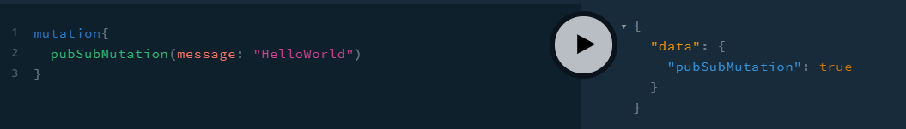
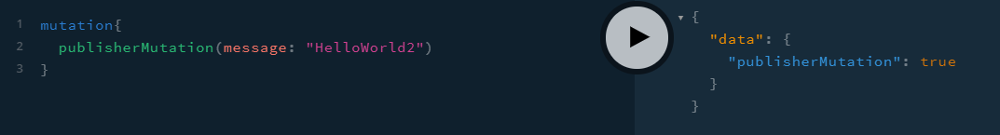
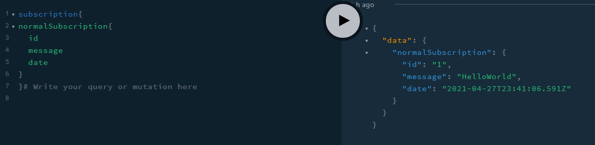
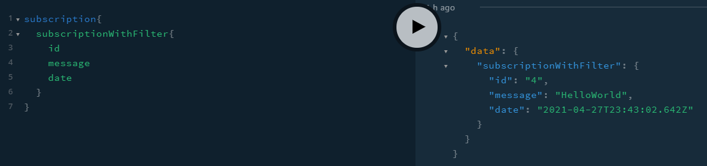

# Graphql Subscription Study

I'm currently (04/2021) developing a software in my University (Uberlândia's Federal University), specifically in the Welding Lab. Currently I'm using Graphql in this project to learn and get to know this tool.

The project is a dashboard with some pages with lists and charts. Now, the project is almost ready but the final step for the first release is for it to be real time. At this point I'm used with resolvers, mutations and queries, I have a solid background in REST API but I don't have experience with WebSockets (unfortunately) and need to learn quickly to finish the project.

So, I'll make a guide and write some thoughts to help future me and others to walk this path.

# Understanding the code

The code starts at the src/index.ts where it is builded the schema and resolver is called.

The notications.type.ts is a pretty standard file of graphql types.

Now, the main part: the resolver. I really recommend to use the playground, it's really easy to visualize.

So, first, there's two mutation that do the same thing in differnt forms: both of them just recieve a message and send it (publishes it) to a subscription. The difference is that the pubSubMutation uses pubSub and the publisherMutation uses a publisher, it's most a difference of syntax.

Now, the subscriptions. The normalSubscription just send the payload that receives normaly. The subscriptionWithFilter just send the payload that has a id even. The pubSubMutationToDynamicTopic is just a payload that makes stuff and not just send data, in this case just add to the index.

# Packages

- Type-graphql
- Typescript
- Graphql

# Commands

## Command Order (to run)

- `node dist` just runs the server, good to play a little and see how it workes.

## Command Order (as developing)

- `npm install typescript --save-dev`
- `npx tsc --init`
- Uncoment the "experimentalDecorators" and "emitDecoratorMetadata" options in the tsconfig.json to alow [decorators](https://www.typescriptlang.org/docs/handbook/decorators.html);
- `npx tsc` build the project in a file called dist

## Command Order (to start developing)

- `npm install`

# Important links

- [Type-graphql guide about Subscriptions](https://typegraphql.com/docs/subscriptions.html)
- [Apollo docs about subscriptions](https://www.apollographql.com/docs/apollo-server/data/subscriptions/#gatsby-focus-wrapper)
